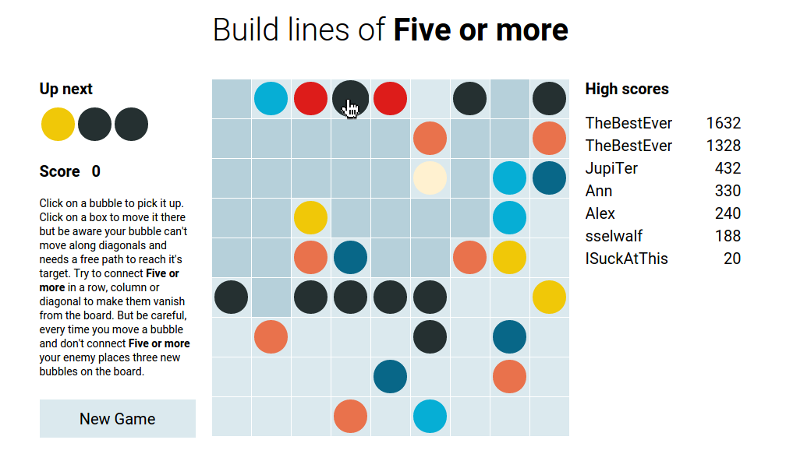

# Five_or_more
WDI 14 LND - Project 1

### Where to find it

Live on the web: **[Five or more](https://sensationnel-saucisson-1393.herokuapp.com/)**

https://sensationnel-saucisson-1393.herokuapp.com/

---

### How it works

* Threre are 6 different colors for bubbles and it's starts out with an empty 9x9 grid.
* There are three colored bubbles on the grid at the start.
* You can click on one of the bubbles and click on an empty box where you want the bubble to go.
* The bubble can only move there if there is a free path (bubbles can't move on diagonals).
* After every move the computer places 3 more random colored bubbles to random empty places on the board.
* If you manage to get 5 or more bubbles of the same color in a row/column/diagonal they are removed from the field and you earn score points. The more bubbles you remove at once, the more points you get.
* After you managed to get bubbles removed you can move a bubble again without the PC adding more bubbles beforehand.
* If the whole board is full the game ends and you can add your score to the high score list.

---

### Techniques used

Every box on the grid has a consecutive id and before the game starts arrays mapping the neighbours of each node are created.
To check whether there are 5 or more bubbles connected an recursive algorithm checks along each possible direction for bubbles of the same color. A simple version of Dijkstra's algorithm is used for finding one of the shortest pathes on the grid.

TO BE UPDATED